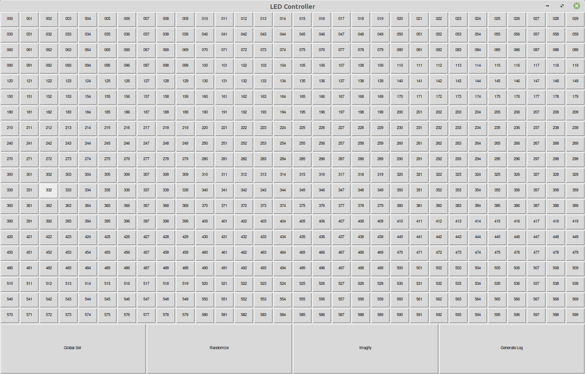
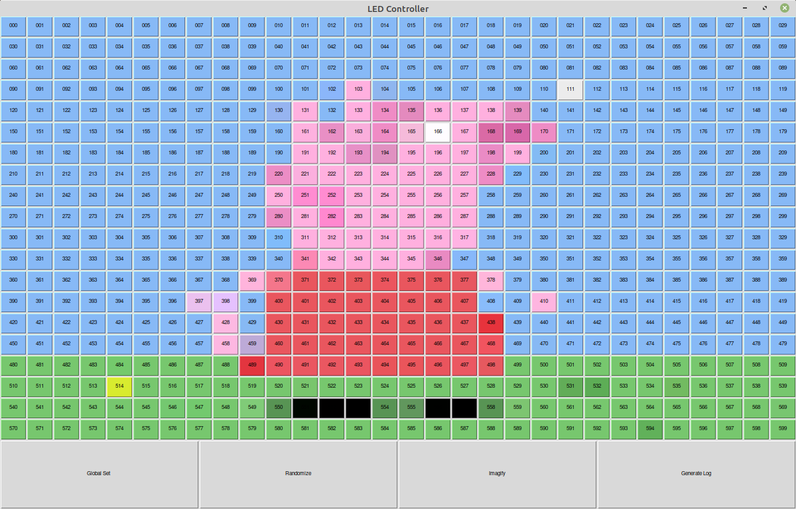

# Pic-2-LED
A program used to map images to an LED array. 
Was made back in 2018 to be used with a 600 LED grid.
The user can upload an image which then gets mapped to each of the LEDs (buttons).
These buttons can be adjusted manually by the user for colour correction (or custom patterns).
Once the user is happy with the end result they can generate a log file specifying the colours for each LED (This is just for example purpose, ideally the user would alter the code to fit their application).

## GUI

## Input

## Output

## Video 
Here is an implementation of the software on a smart bin with a relatively small 10x10 LED grid.
You can see it displaying a heart aswell as a pattern.  

 

